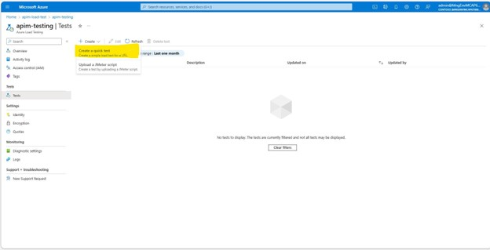
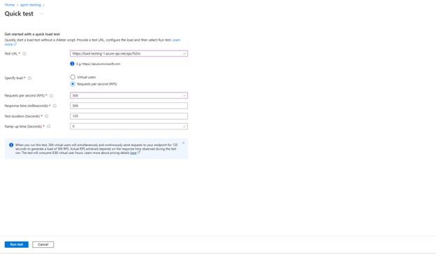
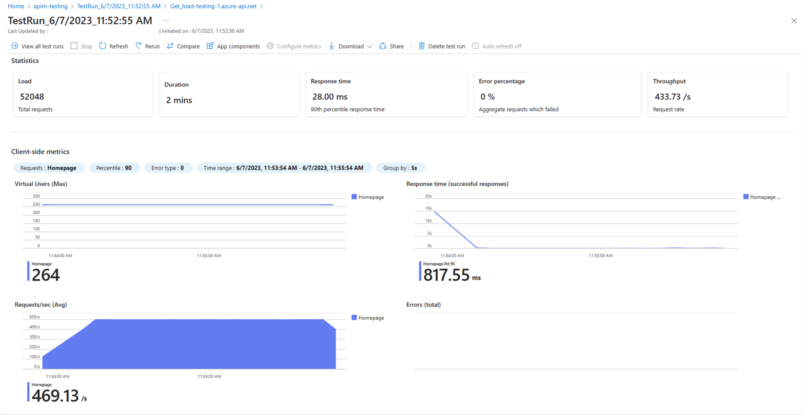
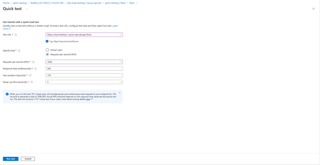
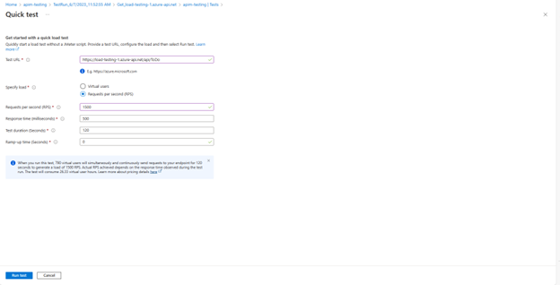
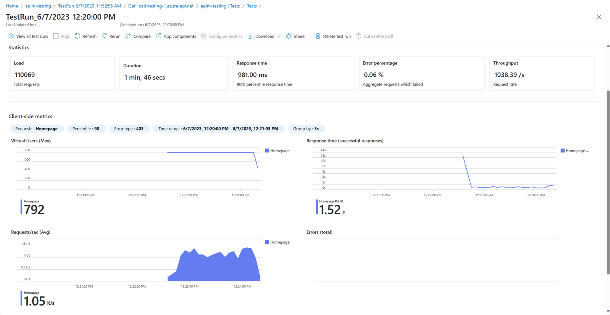
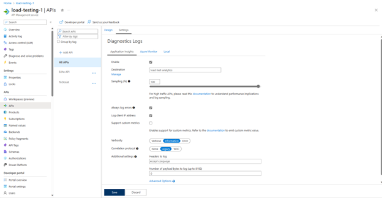
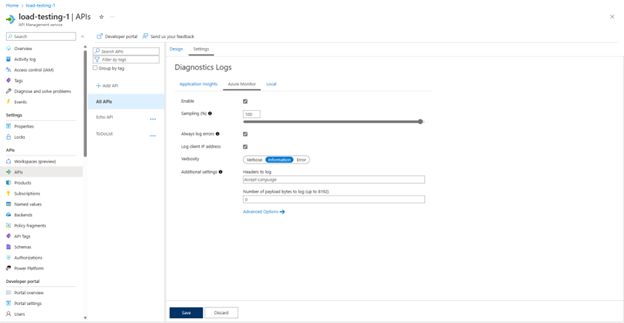
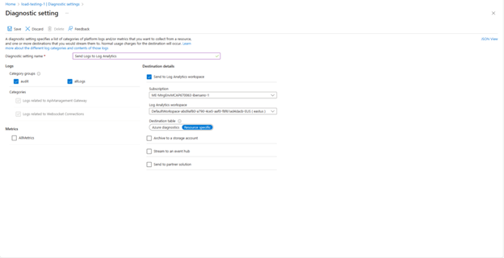

## Introduction

Baseline performance testing involves measuring the performance characteristics of an application or system under normal or expected conditions. It's a [recommended practice](https://learn.microsoft.com/en-us/azure/cloud-adoption-framework/get-started/performance) in any case, but it's a critical consideration for your APIs since your consumers will depend on consistent performance for their client applications.

Incorporating baseline performance testing of your API Management resources into your software delivery process provides several important benefits:

- Establishing a performance benchmark: It sets a baseline RPS against which future performance testing results can be compared to detect any performance regressions or improvements.
- Identifying performance bottlenecks: It helps pinpoint policy changes or integration points that may be causing performance degradation or hindering scalability, in effect helping you to identify which components need to be scaled or configured to maintain performance.
- Validating performance requirements: By comparing the observed RPS against the specified requirements, it ensures that the software meets the desired performance goals in terms of the expected workload it can handle.  This can also help you determine a strategy for implementing [throttling](https://learn.microsoft.com/en-us/azure/architecture/patterns/throttling) or a [circuit breaker pattern](https://learn.microsoft.com/en-us/azure/architecture/patterns/circuit-breaker).
- Guiding performance optimization: Baseline testing highlights areas for optimization, allowing developers to make targeted improvements to enhance the API's performance.
- Enhancing user experience: By identifying and resolving performance issues early in the development life cycle— before your changes make it into production.

### Baseline vs Load Testing. What's the difference?

While the approaches are nominally very similar, the reasons for doing them differ. Baseline performance testing establishes a performance benchmark under normal scale conditions, while load testing evaluates performance under high scale conditions, often to the point of failure. Baseline testing sets a reference point for future iterations, while load testing validates scalability and stress handling. Both are important for ensuring API performance, and you can combine the approaches to suit your needs as long as the goals of each are met.

For this post, we're going to focus on Baseline, with stated goal of establishing a repeatable process to:

"Quantitatively measure the performance impact of any changes I make to my API and determine the scale required to maintain the same level of performance before and after."

## Model Approach

Before we get into specifics, let's look at the general steps that go into designing your baseline performance testing strategy.

1. Identify your performance metric: Determine the key performance metric to measure, such as requests per second (RPS), response time, throughput, CPU or memory utilization, network latency, and database performance. The metrics should align with your requirements and objectives. For API Management, and APIs in general, the easiest and most useful metric to gauge is RPS, and it will usually be highly correlated with other measures as a surrogate choice. For that reason, it's the default choice if your circumstances don't guide you to choose a different metric.

The key here is to choose a single metric so that you can make linear comparisons over time. It's possible to devise your own metric based on an aggregation formula, if required, in order to derive the measurement into to a single numeric value.

1. Define your [benchmark](https://en.wikipedia.org/wiki/Benchmark_(computing)) scenario: It should be realistic and represent typical usage patterns and workload conditions. The scenario should reflect the expected behavior of the system in terms of user interactions, data payloads, etc.

Recommendation: Choose an API operation that meets the criteria and is frequently used by your API consumers. Also, make sure that the performance of the scenario is relatively deterministic, meaning that the baseline measurement would be relatively consistent across repeated measurements using the same code and identical configuration, and not skewed by external or transient conditions.

1. Define the test environment. Whatever method you choose to run the test, just make sure the process is repeatable.

Tip: You want your testing environment to satisfy two important things: First, it should be easy. You don't want to deter yourself from following the process by making it tedious or time-consuming. Second, it needs to be consistent across test runs to ensure the results can be compared reliably.

1. Determine how you will record your chosen metric. It may be required to instrument your code or API Management instance with performance monitoring tools or profiling agents (for example, [Azure Application Insights](https://learn.microsoft.com/en-us/azure/api-management/api-management-howto-app-insights)).

Tip: Be aware that adding observability and instrumentation can, by itself, adversely impact your performance metric, so the ideal case would be a data collection method would be to capture the metric on the client side in your test environment.

1. Execute the test scenario: Run the defined test scenario against the API while measuring the performance metric.
2. Analyze results: Analyze the collected performance data to assess how your API performs. If this isn't your first time running the test, compare the observed performance against the established baseline to determine if the API continues to meet the desired performance objectives and what the impact (if any) of your code or configuration changes may be.

Example: You just added a policy change that decrypts part of the request payload and transforms it into a different format for your backend to consume. You notice that the RPS metric has dropped from 1100/s to 750/s. Your baseline objective RPS is 800. Do you revert the change? Do you scale your API management instance to compensate? Do you try to optimize your recent changes to see if you can get the results to improve? The bottom line here is that you can use the data to make an informed business decision.

1. Report and document: Document the test results, including performance metrics, observations, and any identified issues or recommended actions. This information serves as a reference for future performance testing iterations and as a new baseline for future comparison.
2. Iterate and refine. Find ways to automate or optimize the process or modify your strategy as necessary to improve its usefulness to your business operations and decision making.

  

## Example Scenario Walkthrough

Let's make this more realistic by digging deeper into some implementation details. In the scenario below we would like to enable diagnostic logs for our API Management instance. [Observability](https://learn.microsoft.com/en-us/azure/well-architected/devops/checklist) is a key part of any well-architected cloud workload, and there are a variety of solutions we could choose from. As part of our evaluation of the different options we want to understand the performance impact of each on our API. (Note: We chose this scenario to illustrate a point: You should test the impact of any change you are planning on making, including enabling or disabling a feature of the service itself).

We've decided to evaluate three different "levels" of diagnostic logging for API Management:

1. Logging to Application Insights
2. Logging to Application Insights + Azure Monitor
3. Logging to Application Insights + Azure Monitor + Log Analytics

Now, let's use our Baseline method to compare the three options and assess the impact of each on our chosen metric: average response time. (90th %ile, explain)

First, we need to identify the nominal load conditions for our comparison. Instead of choosing a single value, let's test a range of values that fall within the normal load patterns of our API. If we have done this previously, we could use the same values from prior runs for comparison, but since this is the first time we'll use 500 RPS, 1,000 RPS and 1,500 RPS as our test conditions to represent "low, medium and high" within our normal load range.

In each of the diagnostic logging solutions we are evaluating, we will configure the logging settings on our API Management instance and run a load test for the low, medium and high load conditions we identified.

Azure Load Test is recommended as a testing environment because it doesn't require you to setup JMeter locally to write your own script. Azure Load Test allows you to define parameters in the Azure Portal UI, automatically generates the JMeter script for your test and runs it on test engines that spin up on Azure VMs. We used Azure Load Test for our example here.

See below for setup and configuration instructions, or keep scrolling to see the Results.

  

### Setup

Test Configuration

1. Go to the Azure Portal and retrieve your API URL from your API Management instance. Save this value somewhere because you will need it for the next steps.
2. Search for Azure Load Testing in the Azure Portal
3. Hit Create in the upper left corner
4. Navigate to Tests
5. Click Create on the upper middle of the window and then Create a quick test

    
6. Configure the test with the following parameters for your baseline conditions

    
7. Hit Run test
Once the test completes, you should see results like below:

    
8. Now that we have our baseline test, let's create a test for our medium and high conditions.
9. Create a new quick test with the following medium configuration:

    
Hit Run Test.

Once the test completes, you should see results like below:

10. Create a new quick test with the following high configuration:

    

Hit Run Test.

Once the test completes, you should see results like below:

  

Logging Configuration

Application Insights

  

Azure Monitor

  

Log Analytics

[How to setup a diagnostic setting in API Management](https://learn.microsoft.com/en-us/azure/api-management/api-management-howto-use-azure-monitor#resource-logs)

  

Results

Response times in milliseconds

|Load RPS|Baseline|App Insights|App Insights + Azure Monitor|App Insights, Azure Monitor and Log Analytics|
|---|---|---|---|---|
|500|28|14|9|19|
|1,000|190|759|877|429|
|1,500|981|1040|1340|829|

Average Response times in milliseconds using 1 test engine

|Load RPS|Baseline|App Insights|App Insights + Azure Monitor|App Insights + Azure Monitor + LA|
|---|---|---|---|---|
|500|40.81|76.51|93.61|93.75|
|1,000|79.57|173.88|101.2|301.82|
|1,500|512.08|725.77|456.81|697.33|

To identify the impact of a configuration change, you want to look for significant value changes in your chosen metric that either increase by several fold or by an order of magnitude. For example, if we look at our low condition response times, they remained on roughly the same order of magnitude as the number of loggers increased. From this we can conclude that with an average number of users, we can expect not to see a response time that affects the user experience. Our medium scenario however shows a 4x increase in the response time when we add one logger, but it plateaus after the addition of more loggers. From this we can conclude that logging has a minor impact on medium conditions, and it should be monitored. Our high scenario, like our baseline, showed no significant deviation from the baseline.

  

After completing the analysis, we've determined that going from 500 to 1,000 RPS we experience a several fold increase in response time remaining on the same order of magnitude. Since it's not a significant difference, it could continue to be monitored going forward to see if it gets worse over time. If we'd like to take preventative action, we could [configure an auto-scale rule](https://learn.microsoft.com/en-us/azure/api-management/api-management-howto-autoscale) in our API Management instance to scale up the number of units when the RPS exceeds 500 RPS. Auto-scale rules track by the minute so we would need to configure the rule to scale when requests exceed 30,000. The maximum scale units available depend on your tier: Standard allows 4 total and Premium allows 12 per region.

Another approach would be to manually scale your API Management instance and conduct the load testing again. This would allow you to visibly see the effect of the change on the response time and have confidence that auto-scaling would mitigate the issue before committing to auto scaling.

  
  

### How to do this

- Screenshots for how to set this up
    - Configuration
    - Logging settings
    - Graphs from azure load test
- Here's how to identify that the changes made an impact
- Here's how you can determine how you need to scale your APIM instance to maintain the prior level of performance
    - Quantify the cost of the performance impact -- JON the cost of scaling to the next unit that maintains the metric we measured