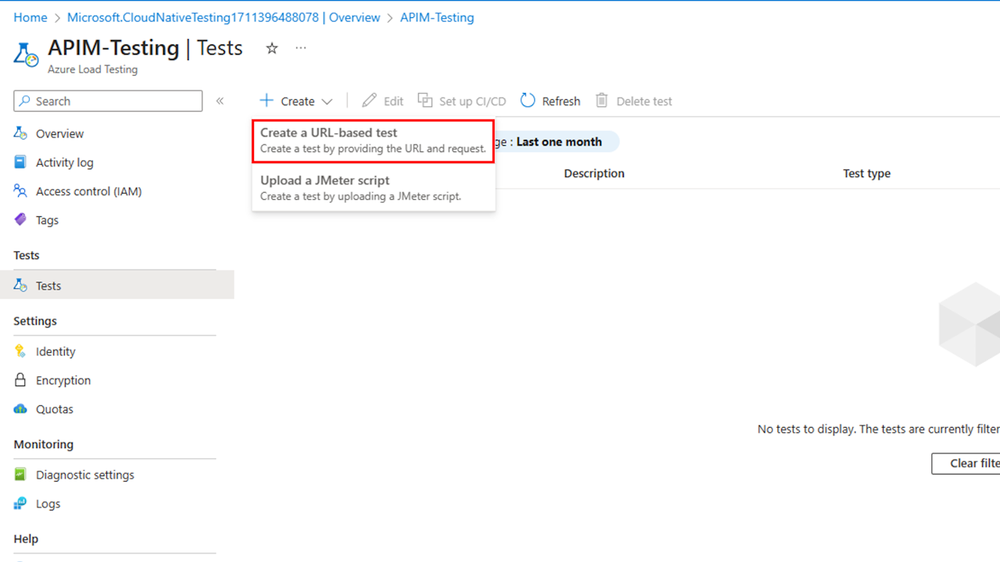

# Benchmark Testing puts you on the path to peak API Performance

This guide explains the best practices you need to know with a full sample to get you started.


## Introduction

Benchmark performance testing involves measuring the performance characteristics of an application or system under normal or expected conditions. It's a [recommended practice](https://learn.microsoft.com/en-us/azure/cloud-adoption-framework/get-started/performance) in any case, but it's a critical consideration for your APIs since your consumers will depend on consistent performance for their client applications.

Incorporating benchmark testing of your Microsoft Azure API Management services into your software delivery process provides several important benefits:

- **It establishes performance baseline** as a known, quantifiable starting point against which future results can be compared.
- **It identifies performance regressions** so that you can pinpoint changes or integrations that may be causing performance degradation or hindering scalability — in effect helping you to identify which components might need to be scaled or configured to maintain performance.  This allows developers and operational staff to make targeted improvements to enhance the performance of your APIs and avoid accumulating performance-hindering technical debt.
- **It validates performance requirements** so you can be assured that the architecture meets the desired operating performance targets.  This can also help you determine a strategy for implementing [throttling](https://learn.microsoft.com/en-us/azure/architecture/patterns/throttling) or a [circuit breaker pattern](https://learn.microsoft.com/en-us/azure/architecture/patterns/circuit-breaker).
- **It improves user experience** by identifying and resolving performance issues early in the development life cycle— before your changes make it into production.
- *And perhaps most importantly*, it gives you the data you need to **create the capacity model** you'll need to operate your APIs efficiently across the entire range of design loads.  This is a topic for a future post, but the methods described here are a a great starting point.

### Benchmark vs Load Testing. What's the difference?

While the approaches and tools involved are nominally very similar, the reasons for doing them differ. Benchmark testing establishes a performance baseline within the normal operational range of conditions, while load testing established the upper boundary or point of failure. Benchmark testing establishes a reference point for future iterations, while load testing validates scalability and stress handling. Both are important for ensuring API performance, and you can combine the approaches to suit your needs as long as the goals of each are met.

For this post, we're going to focus on **the basics of designing a repeatable benchmark test**, with a full walkthrough and all the resources you'll need to do it yourself at the end.

## Model Approach

Before we get into a specific example, let's look at the conceptual steps involved.

Broadly, there are two stages:

- **Design and Planning**: Decide what to measure, and how to measure it. (Steps 1-4 below)
- **Execution**: Run test, collect results, and use the results to inform future actions or decisions.  (Steps 5-7)

The execution stage is repetitive.  The first execution result becomes the baseline.  From there, the benchmark test can be repeated after any important change to your API workload (resource configuration, backend application code, *etc.*).  Comparing the results of the current and previous test will indicate whether the most recent change moved you closer to your goal, or caused a regression.  Once the goal is met, you'll continue the practice with future changes to ensure that the required performance is being maintained.

### 1. Identify your benchmark metric

Determine the key performance metric that will define your benchmark.  Think of it as the [key performance indicator (KPI)](https://en.wikipedia.org/wiki/Performance_indicator) of your API workload.  Some examples include: operation or request duration, failure rate, resource utilization (*eg,* memory usage), data transfer speed, and database transaction time. The metric should align with your requirements and objectives, and be a good indicator for the quality of the consumer experience. For API Management, and APIs in general, the easiest and most useful metric is usually response time.  For that reason, start with response time as the default choice if your circumstances don't guide you to choose something else.

The key here is to choose a single metric that you can capture easily and consistently, is an indicator of the kind of performance you are after, and that will allow you to make linear comparisons over time. It's possible to devise your own composite metric based on an aggregation formula using multiple primitives, if required, in order to derive a single benchmark measurement that works best for you.

> **Tip:** *Requests per second (RPS) might be the first metric you think of when you are trying to decide what you should measure.  Similar unit-per-second metrics have been used historically for benchmark everything from web servers to GPUs.  But in reality, RPS by itself isn't very useful as a benchmark for APIs. It's not uncommon to observe a system achieve a "high" RPS while individual consumers are simultaneously experiencing "slow" response times. For this reason, we recommend that you only use RPS as a scenario parameter and choose something else as your benchmark metric.*  

### 2. Define the benchmark scenario

The scenario describes input parameters and the simulation.  In other words, it describes what is happening in the system while the benchmark metric is being measured. For example, *"1000 simulated users, calling the Product Search API, at a rate of 10 searches per minute per user"*.  The scenario should be as simple as possible while also providing a realistic representation of typical usage and conditions. It should accurately reflect the behavior of the system in terms of user interactions, data payloads, etc.  For example, if your API relies on caching to boost performance, don't use a scenario that results in an unrealistically high cache hit rate.

> **Tip:** *For an existing application, choose an API operation that represents an important use case and is frequently used by your API consumers. Also, make sure that the performance of the scenario is relatively deterministic— meaning that you expect the test results to be relatively consistent across repeated runs using the same code and configuration, and the results aren't likely to be skewed by external or transient conditions.  For example, if your API relies on a shared resource (like a database), make sure the external load on that resource isn't interfering with your benchmark.  When it doubt, use multiple test runs and compare the results.*

### 3. Define the test environment

The test environment includes the tool that will run the simulation ([JMeter](https://jmeter.apache.org/), for example), along with all the resources your API requires.  Generally speaking, you should use a dedicated environment that models your production environment as closely as possible, including compute, storage, networking, and downstream dependencies.  If you have to use mocks for any of your dependencies, make sure that they are accurately simulating the real dependency (network latency, long running processes, data transfer, etc).  

> **Tip:** *You want your testing environment to satisfy two conditions:*
  >
  > - *It makes it easy to set up and execute the test. You don't want to deter yourself from running tests because the process is tedious or time-consuming.*
  > - *It is consistent and repeatable across test runs to ensure the observed results can be compared reliably.*
  >
  >*Automation helps you achieve both of these things.*

### 4. Determine how you will record your chosen metric

You may need to instrument your code or API Management service with performance monitoring tools or profiling agents (*for example,* [Azure Application Insights](https://learn.microsoft.com/en-us/azure/api-management/api-management-howto-app-insights)).  You may also need to consider how you will retrieve and store the results for future analysis.

> **Tip:** *Be aware that adding observability and instrumentation can, by itself, adversely impact your performance metric, so the ideal case (if the observability tooling isn't already part of your production-ready design) would be a data collection method that captures the data at the client (or agent, in the case of Azure Load Testing).*  

### 5. Execute the test scenario

Run the defined test scenario against the API while measuring the performance metric.

### 6. Analyze the results

Analyze the collected performance data to assess how your API performs. If this isn't your first time running the test, compare the observed performance against previous executions to determine if the API continues to meet the desired performance objectives and what the impact (if any) of your code or configuration changes may be.  There are statistical methods that can applied to aid this analysis, which are extremely useful in automated tests or pull request reviews.  These methods are beyond the scope of this post, but it's a good idea to familiarize yourself with some of the [approaches](https://www.statisticshowto.com/effect-size/).

**For Example:** You just added a policy change that decrypts part of the request payload and transforms it into a different format for your backend to consume. You notice that the RPS metric has dropped from 1100/s to 750/s. Your benchmark objective RPS is 800. Do you revert the change? Do you scale your API management service to compensate? Do you try to optimize your recent changes to see if you can get the results to improve? The bottom line here is that you can use the data to make an informed decision.

### 6. Report and document

Document the test results, including performance metrics, observations, and any identified issues or recommended actions. This information serves as a reference for future performance testing iterations and as a new benchmark for future comparison.

### 7. Iterate and refine

Finally, find ways to automate or optimize the process or modify your strategy as necessary to improve its usefulness to your business operations and decision making.  In a future article, we'll talk more about how to operationalize benchmark testing and how to use it as a powerful capacity management tool.

## Walkthrough

Let's make this more realistic with a basic example. For the purposes of this walkthrough, we've developed an automated environment setup using Terraform. The environment includes an API Management service, a basic backend ([httpbin](https://github.com/postmanlabs/httpbin), hosted in an Azure App Service plan), and an Azure Load Testing resource.

> **Tip:** *Use the Terraform templates provided in the repo to deploy all the resources you'll need to follow along.  For operational use, we recommend that you create your own repository using our repo as a template, and then follow the instructions in the README to configure the GitHub workflows for deployment to your Azure subscription. Once configured, the workflow will deploy the infrastructure and then run the load tests for you automatically.*

You are free to choose any testing tools that fit your needs, but we recommend [Azure Load Testing](https://azure.microsoft.com/en-us/products/load-testing).  It doesn't require you to install JMeter locally or author your own test scripts. It allows you to define parameters, automatically generates the JMeter script for your test, and manages all the underlying resources required for the test agents. Most importantly, it avoids many of the problems we'd be likely to encounter with client-based tools and gives us the repeatability we need.

Let's look at how we'll apply our model approach in the example:
|||
|--|--|
|**Performance metric** |Average response time|
|**Benchmark scenario** | Performance will be measured under a consistent request rate of 500 requests per second. |
|**Environment**|The sample environment - an App Service Web App that hosts the backend API and an API Management Service configured with one scale unit. Both are located in the same region, along with the Azure Load Testing resource. The deployment assets for all resources are included. |

### Deploy the Azure resources

1. Open Azure [Cloud Shell](https://portal.azure.com/#cloudshell/) and run the following commands.

2. Clone the Repository

```bash
git clone https://github.com/ibersanoMS/api-management-benchmarking-sample.git
cd api-management-benchmarking-sample/src/infra
```

3. Initialize Terraform

```bash
terraform init
```

4. Plan the Deployment

```bash
terraform plan -out=tfplan
```

5. Apply the Terraform Templates

```bash
terraform apply tfplan
```

### Test Configuration

The Terraform templates will configure the load tests for you, but if you want to create tests on your own without automation the steps below will walk you through it.

1. Go to the Azure Portal and retrieve your backend URL. Save the value somewhere because you will need it for the next steps. If you're using the sample environment provided, it will be your App Service Hostname URL.
2. Search for Azure Load Testing in the Azure Portal
3. Hit Create in the upper left corner
4. Navigate to Tests
5. Click Create on the upper middle of the window and then Create a URL-based test

    

6. Configure the test with the following parameters for your first case (500B payload)

    

7. Hit Run test

    Once the test completes, you should see results like below:

    

8. Now that we have our baseline test, let's create a test for our medium and large sized payload conditions.

    

9. Create a new quick test with the following medium-sized payload configuration:

    Hit Run Test.

    Once the test completes, you should see results like below:

    

10. Create a new quick test with the following large-sized payload configuration:
it Run Test.

    

    Once the test completes, you should see results like below:

    

### Sample Results

In our first benchmark, we are establishing a performance baseline of the backend application which returns a 500 byte payload.  In this first step, the backend is tested in isolation (meaning the load test client is sending requests directly to the backend API end point, without API Management) so that we can measure how it performs on its own.  Below are the results of three separate test runs:

|Throughput (RPS)|Average Response Time (ms)|
|---|---|
|444|21|
|431|14|
|447|15|

Next, we run the same test using the API Management endpoint.  Requests are now being proxied through API Management to the backend application.  This will help us measure any latency to change in performance added by API Management.  As we can see, the results are similar:

|Throughput (RPS)|Average Response Time (ms)|
|---|---|
|443|15|
|441|14|
|436|10|

Finally, we run a benchmark on a new "release" of our backend application.  The new version of the API now returns a larger 1,500 byte payload.  We can from the results that response times have increased significantly, and (assuming these results don't meet our performance objectives) we now know that remediation steps will need to be taken before the new release of our API can be deployed to production.

|Throughput (RPS)|Average Response Time (ms)|
|---|---|
|361|600|
|370|518|
|367|585|

## Helpful Resources

- [Performance tuning a distributed application](https://learn.microsoft.com/en-us/azure/architecture/performance/)
- [Autoscaling](https://learn.microsoft.com/en-us/azure/architecture/best-practices/auto-scaling)
- [Automate an existing load test with CI/CD](https://learn.microsoft.com/en-us/azure/load-testing/quickstart-add-load-test-cicd)
- [Add caching to improve performance in Azure API Management](https://learn.microsoft.com/en-us/azure/api-management/api-management-howto-cache)
- [Troubleshooting client response timeouts and errors with API Management](https://learn.microsoft.com/en-us/azure/api-management/troubleshoot-response-timeout-and-errors)