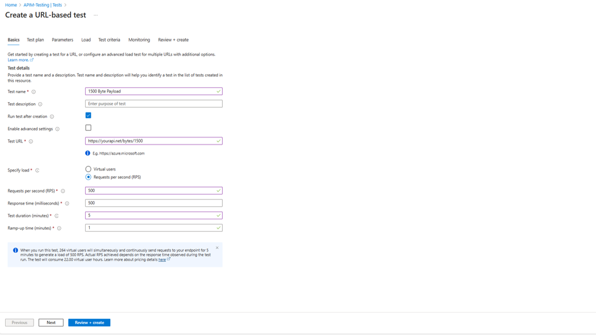
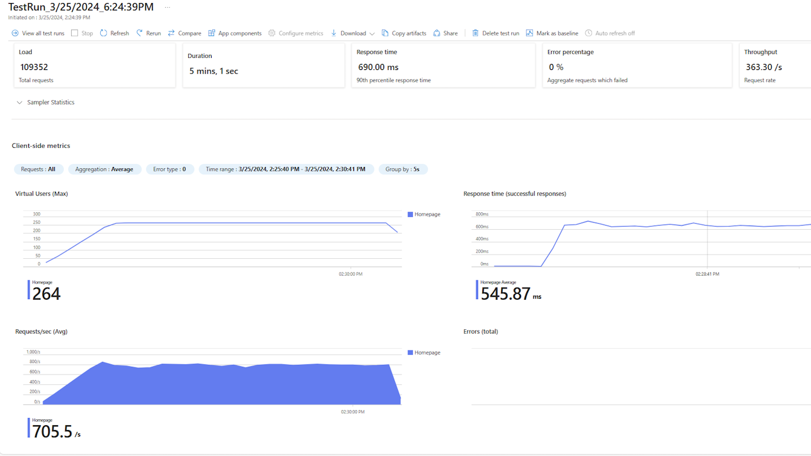

## Introduction

Benchmark performance testing involves measuring the performance characteristics of an application or system under normal or expected conditions. It's a [recommended practice](https://learn.microsoft.com/en-us/azure/cloud-adoption-framework/get-started/performance) in any case, but it's a critical consideration for your APIs since your consumers will depend on consistent performance for their client applications.

Incorporating benchmark testing of your API Management resources into your software delivery process provides several important benefits:

- It establishes performance baseline: It sets a quantifiable baseline against which future results can be compared to detect any performance regressions or improvements.
- It identifies performance regressions: It helps pinpoint changes or integration points that may be causing performance degradation or hindering scalability— in effect helping you to identify which components need to be scaled or configured to maintain performance.  This allows developers and operational staff to make targeted improvements to enhance the performance of your API's.
- It validates performance requirements: By comparing the observed metrics against the specified requirements, you can be assured that the architecture meets the desired operating performance targets.  This can also help you determine a strategy for implementing [throttling](https://learn.microsoft.com/en-us/azure/architecture/patterns/throttling) or a [circuit breaker pattern](https://learn.microsoft.com/en-us/azure/architecture/patterns/circuit-breaker).
- It improves user experience: By identifying and resolving performance issues early in the development life cycle— before your changes make it into production.
- And perhaps most importantly, it gives you the data you need to derive the capacity model you'll need to operate your API's efficiently accross the entire range of design loads.

### Benchmark vs Load Testing. What's the difference?

While the approaches and tools involved are nominally very similar, the reasons for doing them differ. Benchmark testing establishes a performance baseline within the normal operational range of conditions, while load testing established the upper boundary or point of failure. Benchmark testing establishes sets a reference point for future iterations, while load testing validates scalability and stress handling. Both are important for ensuring API performance, and you can combine the approaches to suit your needs as long as the goals of each are met.

For this post, we're going to focus on the basics of designing a repeatable benchmark test, with a full walkthrough and all the resources you'll need to do it yourself at the end.

## Model Approach

Before we get into specifics, let's look at the general steps that go into designing your benchmark performance testing strategy.

### 1. Identify your performance metric(s).
Determine the key performance metrics to measure, such as requests per second (RPS), response time, throughput, CPU or memory utilization, network latency, and database performance. The metrics should align with your requirements and objectives. For API Management, and APIs in general, the easiest and most useful metric is usually response time.  For that reason, start with reponse time as the default choice if your circumstances don't guide you to choose something else.

The key here is to choose metrics that you can capture easily and consistently, and that will allow you to make linear comparisons over time. It's possible to devise your own composite metrics based on an aggregation formula using multiple primitives, if required, in order to derive measures that work best for you.

> **Tip:** *Although misguided, RPS is often considered to be the primary metric for API benchmarking.  This might be because similar metrics have been used historically to benchmark everything from web servers to GPUs.  In reality, RPS isn't very useful for <u>benchmarking</u> APIs since API consumers will mostly be concerned with how long it takes your API to respond to their client requests.*  

### 2. Define your [benchmark](https://en.wikipedia.org/wiki/Benchmark_(computing)) scenario.
It should be realistic and represent typical usage patterns and workload conditions. The scenario should reflect the expected behavior of the system in terms of user interactions, data payloads, etc.

> **Tip:** *Choose an API operation that meets the criteria and is frequently used by your API consumers. Also, make sure that the performance of the scenario is relatively deterministic, meaning that the benchmark measurement would be relatively consistent across repeated measurements using the same code and identical configuration, and not skewed by external or transient conditions.*

### 3. Define the test environment. 
Whatever method you choose to run the test, just make sure the process is *repeatable*.

> **Tip:** *You want your testing environment to satisfy two important things: First, it should be easy. You don't want to deter yourself from following the process by making it tedious or time-consuming. Second, it needs to be consistent across test runs to ensure the results can be compared reliably.*

### 4. Determine how you will record your chosen metric. 
You may need to instrument your code or API Management service with performance monitoring tools or profiling agents (*for example,* [Azure Application Insights](https://learn.microsoft.com/en-us/azure/api-management/api-management-howto-app-insights)).  

Again, *repeatability is the key.*

> **Tip:** *Be aware that adding observability and instrumentation can, by itself, adversely impact your performance metric, so the ideal case (if the observability tooling isn't already part of your production-ready design) would be a data collection method would be to capture the metric on the client side in your test environment.*  

### 5. Execute the test scenario.
Run the defined test scenario against the API while measuring the performance metric.

### 6. Analyze the results.
Analyze the collected performance data to assess how your API performs. If this isn't your first time running the test, compare the observed performance against the established benchmark to determine if the API continues to meet the desired performance objectives and what the impact (if any) of your code or configuration changes may be.

*For Example:* You just added a policy change that decrypts part of the request payload and transforms it into a different format for your backend to consume. You notice that the RPS metric has dropped from 1100/s to 750/s. Your benchmark objective RPS is 800. Do you revert the change? Do you scale your API management service to compensate? Do you try to optimize your recent changes to see if you can get the results to improve? The bottom line here is that you can use the data to make an informed business decision.

### 6. Report and document.
Document the test results, including performance metrics, observations, and any identified issues or recommended actions. This information serves as a reference for future performance testing iterations and as a new benchmark for future comparison.
### 7. Iterate and refine. 
Finally, find ways to automate or optimize the process or modify your strategy as necessary to improve its usefulness to your business operations and decision making.  We'll talk more about how to operationalize benchmark testing as part of your capacity management practices in a future post.

## Walkthrough

Let's make this more realistic with a basic example. For the purposes of this walkthrough, we've developed an automated environment setup using Terraform. The environment includes an API Management service, a basic backend ([httpbin](https://github.com/postmanlabs/httpbin), hosted in an App Service plan), and an Azure Load Testing resource. 

> **Tip:** *Use the Terraform templates provided in the repo to deploy all the resources you'll need to follow along.  For operational use, we recommend that you create your own repository using our repo as a template, and then follow the instructions in the README to configure the GitHub workflows for deployment to your Azure subscription. Once configured, The workflow will deploy the infrastructure and then run the load tests for you automatically.*

You are free to choose any testing tools that fit your needs, but we recommend [Azure Load Testing](https://azure.microsoft.com/en-us/products/load-testing).  It doesn't require you to install JMeter locally or author your own test scripts. It allows you to define parameters, automatically generates the JMeter script for your test, and manages all the underlying resources required for the test agents. Most importantly, it avoids many of the problems we'd be likely to encounter with client-based tools and gives us the repeatability we need.

Let's look at how we'll apply our model approach in the example:
|||
|--|--|
|**Performance metric** |Average response time|
|**Benchmark scenario** | Performance will be measured under a consistent request rate of 500 RPS, but we will vary the request payload size across 3 different test runs (500 bytes, 1000 bytes, and 1500 bytes).  The scenario will be first run with requests being sent directly to the backend, and then the scenario will be repeated with APIM as the gateway endpoint.|
|**Environment**|The sample environment an App Service with our backend and an API Management Servcie with one scale unit. Both are located in the same region, along with the Azure Load Test resource. The deployment assets for all resources are included. |

## Steps
### Deploy the Azure resources

//TODO: Quick steps to deploy using Terraform

### Test Configuration

1. Go to the Azure Portal and retrieve your backend URL. Save the value somewhere because you will need it for the next steps. If you're using the sample environment provided, it will be your App Service Hostname URL.
2. Search for Azure Load Testing in the Azure Portal
3. Hit Create in the upper left corner
4. Navigate to Tests
5. Click Create on the upper middle of the window and then Create a URL-based test

    
6. Configure the test with the following parameters for your first case (500B payload)

    
7. Hit Run test

    Once the test completes, you should see results like below:

    
8. Now that we have our baseline test, let's create a test for our medium and large sized payload conditions.

    
9. Create a new quick test with the following medium-sized payload configuration:

    Hit Run Test.

    Once the test completes, you should see results like below:
    

10. Create a new quick test with the following large-sized payload configuration:
it Run Test.

    

    Once the test completes, you should see results like below:
    
    

> Repeat the above steps for each case using the API URL from your APIM instance.

# Results

Backend Only

500B payload, 500 RPS

|Throughput (RPS)|Average Response Time (ms)|
|---|---|
|444|21|
|431|14|
|447|15|

1000B payload, 500 RPS

|Throughput (RPS)|Average Response Time (ms)|
|---|---|
|425|97|
|432|41|
|428|50.77|

1500B payload, 500 RPS

|Throughput (RPS)|Average Response Time (ms)|
|---|---|
|290|612|
|358|604|
|363|545|

  

APIM + Backend

500B Payload, 500 RPS

|Throughput (RPS)|Average Response Time (ms)|
|---|---|
|443|15|
|441|14|
|436|10|

1,000B Payload, 500 RPS

|Throughput (RPS)|Average Response Time (ms)|
|---|---|
|443|155|
|446|76.55|
|444|70|

1,500B Payload, 500 RPS

|Throughput (RPS)|Average Response Time (ms)|
|---|---|
|361|600|
|370|518|
|367|585|

## Analysis

If we take the average of each three runs for each case, we can plot the response times versus payload size for the backend and the system as a whole. If we look at the chart above, the average response times of the backend are very close to those of the backend by itself. This indicates that under normal load conditions and increasing payload size, introducing APIM into the environment does not have a significant effect on the average response time. If we had noticed that it did have an effect, we could [configure an auto-scale rule](https://learn.microsoft.com/en-us/azure/api-management/api-management-howto-autoscale) in our API Management instance to scale up the number of units when the response time starts to increase beyond a certain value. Auto-scale rules track by the minute. The maximum scale units available depend on your tier: Standard allows 4 total and Premium allows 12 per region.

Another approach would be to manually scale your API Management instance and conduct the load testing again. This would allow you to visibly see the effect of the change on the response time and have confidence that auto-scaling would mitigate the issue before committing to auto scaling.

If you notice that your backend performance is not where you want it to be and placing APIM in front perpetuates the issue, consider scaling your backend to distribute the load and re-run the load tests.

## Next Steps  
  
  

Things we need to talk about:

- Every change has a non-trivial effect on the system as a whole
    - Networking
    - Self-hosted vs. managed gateway
    - Monitoring
    - Backend changes
    - Database updates
- Monitoring during load testing
    - Backend hosted on AKS can use Prometheus, Grafana for networking monitoring, etc.